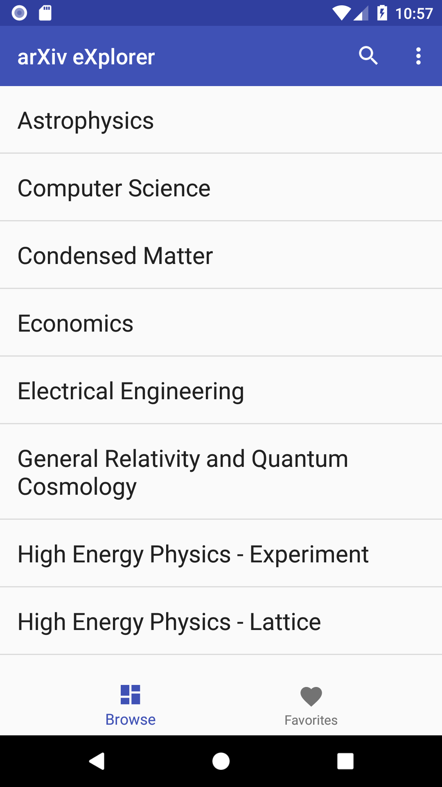
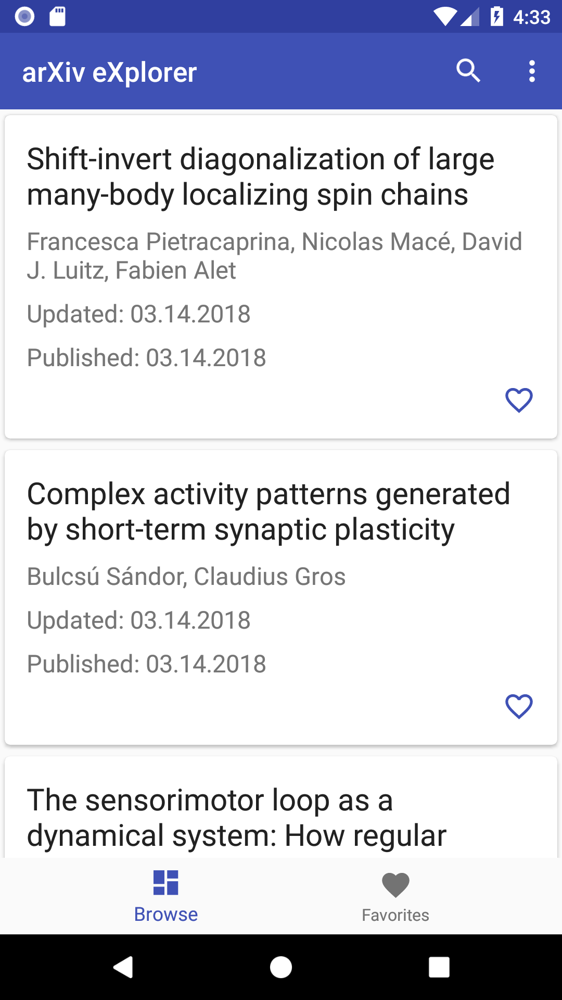
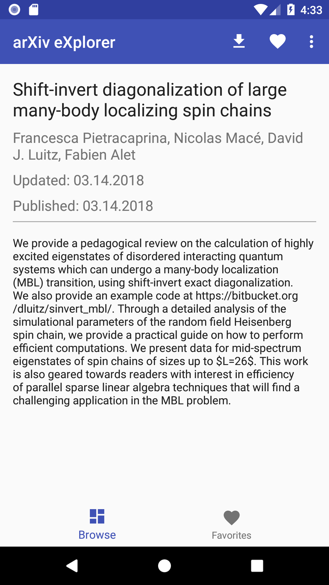

# arXiv eXplorer 
[](https://travis-ci.org/GarrettBeatty/arXiv-eXplorer)

arXiv eXplorer is an Android App for [arxiv.org](http://www.arxiv.org).
<a href='https://play.google.com/store/apps/details?id=com.gbeatty.arxiv&pcampaignid=MKT-Other-global-all-co-prtnr-py-PartBadge-Mar2515-1'></a>

Features include:
* Browse categories (Physics, Astronomy, Computer Science, etc)
* Search for arXiv articles
* Favorite arXiv articles
* Pagination
* Download PDFs
* Material Design
* Free
* Open Source

## Screenshots
 
 

## Downloading

```
git clone https://github.com/GarrettBeatty/arXiv-eXplorer.git
```

## Running the tests

```
./gradlew test
```

## Built With

* [OkHttp](http://square.github.io/okhttp/)
* [Sugar ORM](http://satyan.github.io/sugar/)
* [Travis CI](https://travis-ci.org/)
* [Fastlane](https://fastlane.tools/)

## Contributing

Please read [CONTRIBUTING.md](CONTRIBUTING.md) for details on our code of conduct, and the process for submitting pull requests to us.

## Authors

* **Garrett Beatty**

## License

This project is licensed under the GNU General Public License v3.0 - see the [LICENSE.md](LICENSE.md) file for details